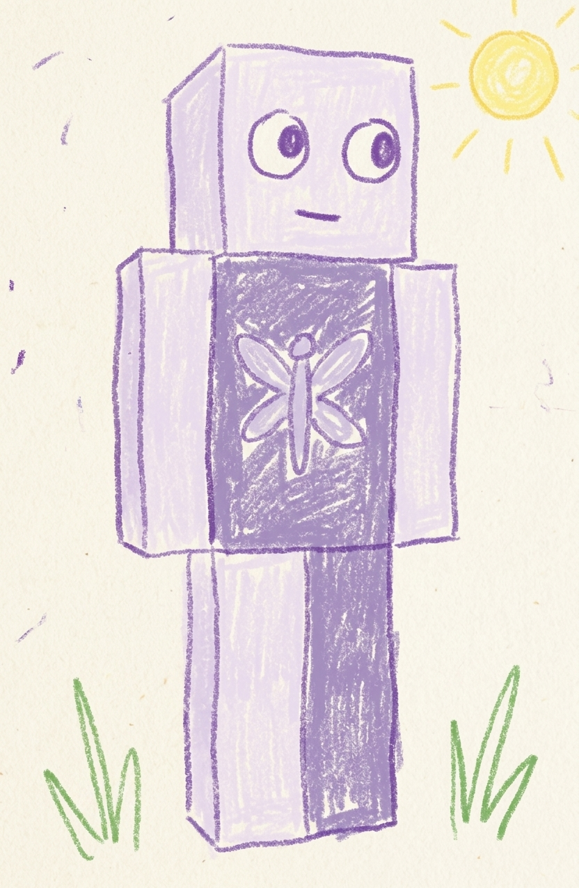
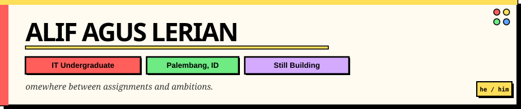
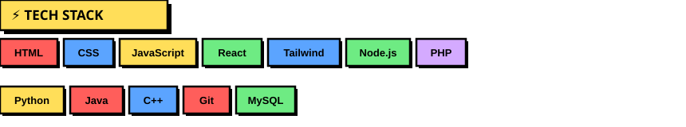

<table border="0" cellpadding="0" cellspacing="0">
  <tr>
    <td width="140" valign="middle">
      
    </td>
    <td valign="middle">
      
    </td>
  </tr>
</table>

 

---

Hey, I'm **Alif** — an IT undergraduate who likes building things on the web and turning random ideas into actual projects.

Still learning, still experimenting, and somehow trying to build a future through code while surviving university deadlines.

 

📷 **Instagram** — [@yr.lifeqxz_](https://instagram.com/yr.lifeqxz_)  
💬 **Discord** — `alzerox2`  
🔗 **LinkedIn** — [https://www.linkedin.com/in/alifaguslerianbd/](hwww.linkedin.com/in/alifaguslerianbd)

---

 

 

## 📊 Stats

<table border="0" cellpadding="8" cellspacing="0">
  <tr>
    <td>
      
    </td>
    <td>
      
    </td>
  </tr>
</table>

 

 

---

  <i>"Learning code while overthinking the future — still building anyway."</i>

