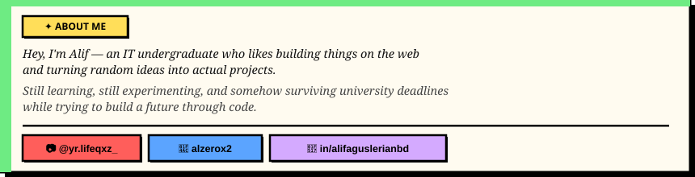

<table border="0" cellpadding="0" cellspacing="0">
  <tr>
    <td width="140" valign="middle">
      
    </td>
    <td valign="middle">
      
    </td>
  </tr>
</table>

 

 

 

 

---

  <i>"Learning code while overthinking the future — still building anyway."</i>

